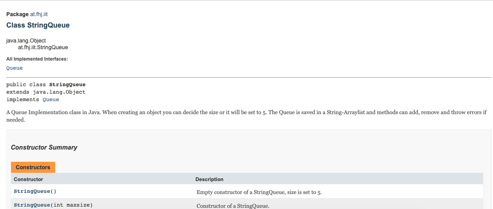
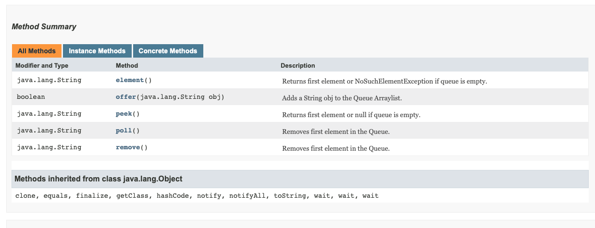
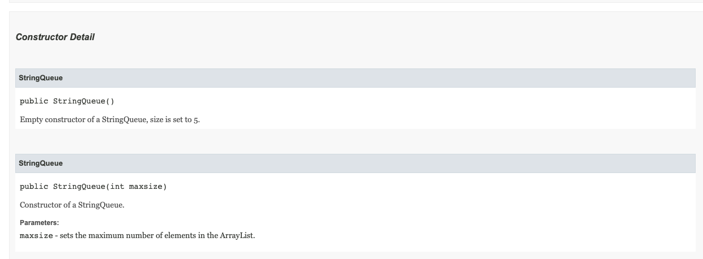
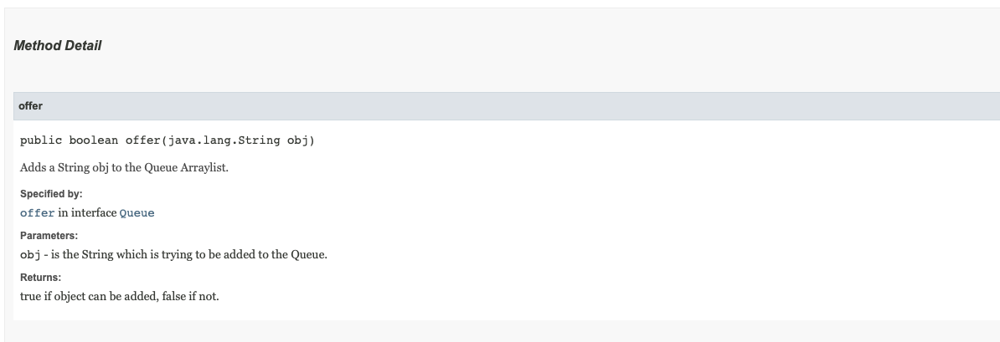
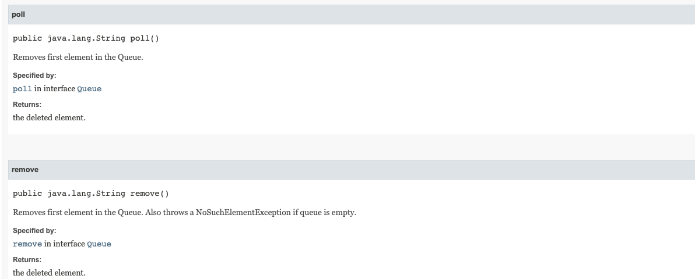
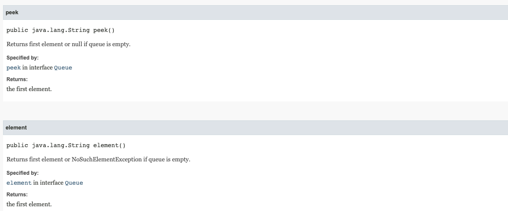
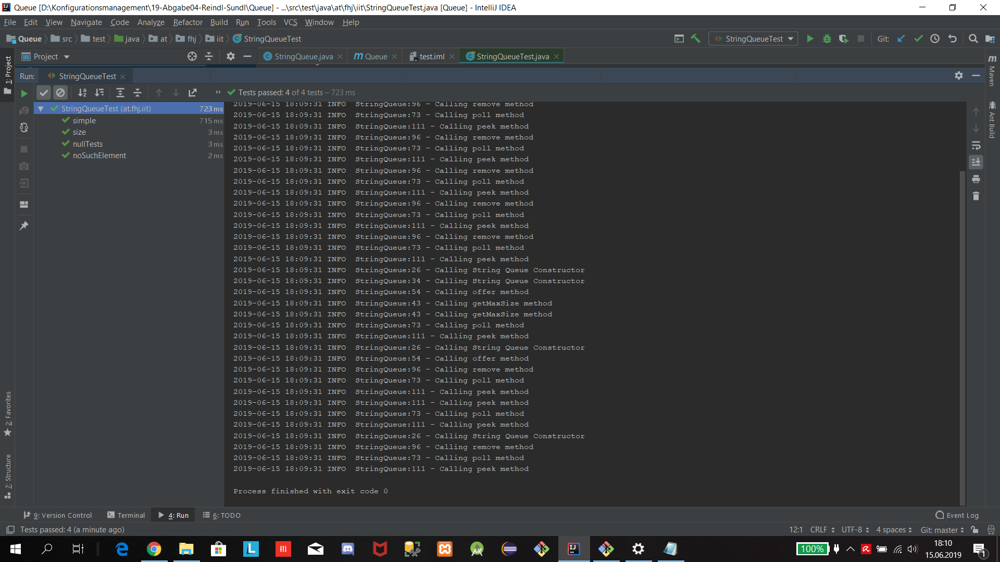
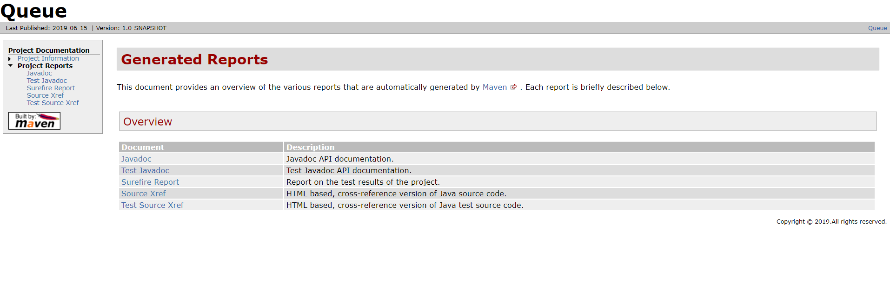

# Software Configuration Management #

**EDUCATION Repository**

## Test Automation with JUnit ##

### Queue Exercise ###

##Taskliste

- [+] Tasklist
- [+] Code correction/debugging
- [+] Comment classes and methods to generate an API documentation via Javadoc (take picture!)
- [+] Implementation of JUnit-Tests
- [+] Adjust pom.xml
- [+] Integrate Log4j(v2) and write to log in each method
- [+] Create Maven-Site documentation
- [+] Markdown Lab-Report
- [+] Check all tasks for completeness
- [+] Create PDF-Version and hand it in

# Vorgehen

Nach dem clonen des Projekts von Github auf den Computer von Simon haben wir
die Aufgaben nacheinander durchgeführt.

## Code correction/debugging

Auf Simons Computer haben wir gemeinsam die Fehlersuche durchgeführt.
Dabei haben wir die Fehler ausgebessert und im Source Code Kommentare hinterlassen.

## Comment classes and methods to generate an API documentation via Javadoc

Die Kommentare (Klassen und Methoden) haben wir auf Jakobs Rechner verfasst und die API Dokumentation erzeugt.








## Implementation of JUnit-Tests

Jakob hat die JUnit Tests auf seinem Rechner durchgeführt. Wir haben gemeinsam überlegt welche Schritte dazu nötig sind und welche Tests wir benötigen.


## Adjust pom.xml

Die pom.xml wurde mit Entwickler, Pluggins und Dependencies erweitert.

## Integrate Log4j(v2) and write to log in each method

Mit Hilfe von Dependencies in der pom.xml und einem Property-File, dass wir im Ressourcen Ordner erstellt haben konnte der Log4j Logger angewandt werden:




## Create Maven-Site documentation

Die Voraussetzungen für den "mvn site" command wurden in der pom.xml inkludiert. Danach wurde der Command ausgeführt und das Ergebnis des index.html im site Ordner war folgendes:




##  Markdown Lab-Report

Der Markdown Lab-Report wurde mit Atom geschrieben und formatiert. Anschließend wurde das File auf der Webseite "www.dillinger.io" in PDF Format exportiert.

Python Beispiel:

```python
print "Hello World!"
a = "Thanks for reading"
print(a)
```

```java
int a = 2;
int b = 3;
int homework = a + b - 1;
```
